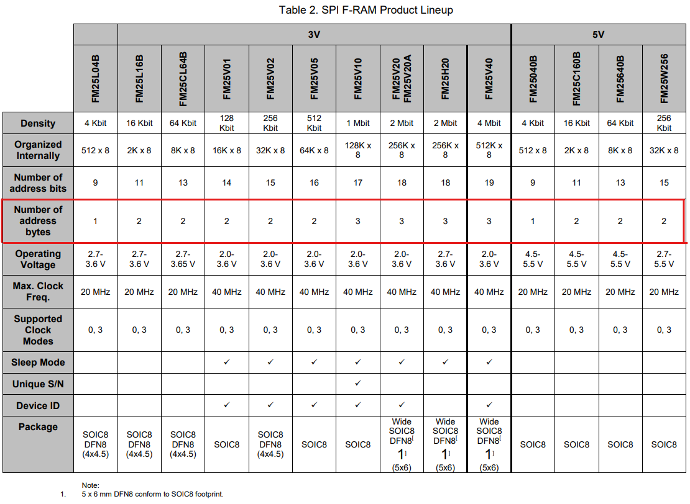

# **Cypress (Infineon) FM25 SPI F-RAM Device Library**
General embedded C driver for FRAM FM25 SPI based device interface.

Driver support whole FM25xxxxx device family if correctly configurable. Driver is also platform independent as it proved additional wrapper (interface) functions that user must provide before using driver.

[Link to device family datasheet](https://www.infineon.com/dgdl/Infineon-AN304_SPI_Guide_for_F-RAM-ApplicationNotes-v02_00-EN.pdf?fileId=8ac78c8c7cdc391c017d0727aef04c26) 


## **Driver Configuration**

Based on following table, configuration of the driver shall be made:


NOTICE: Change value of *FM25_CFG_ADDR_BIT_NUM* accordingly to used FRAM device inside *fm25_dfg.h*:
```C
/**
 *  Device number address bits
 *
 */
#define FM25_CFG_ADDR_BIT_NUM           ( 9 )
```

## **Dependencies**

### **1. Low Level SPI Interface**
Interface functions needs to be provided inside ***fm25_if.c/.h***:
```C
fm25_status_t 	fm25_if_init		(void);
fm25_status_t 	fm25_if_transmit	(const uint8_t * p_data, const uint32_t size, const spi_cs_action_t cs_action);
fm25_status_t 	fm25_if_receive		(uint8_t * p_data, const uint32_t size, const spi_cs_action_t cs_action);
```

## **General Embedded C Libraries Ecosystem**
In order to be part of *General Embedded C Libraries Ecosystem* this module must be placed in following path: 

```
root/drivers/devices/fm25/fm25/"module_space"
```

## **API**
| API Functions | Description | Prototype |
| --- | ----------- | ----- |
| **fm25_init**         | Initialization of FM25 driver module      | fm25_status_t fm25_init(void)                                                                         |
| **fm25_deinit**       | De-initialization of FM25 driver module   | fm25_status_t fm25_deinit(void)                                                                       |
| **fm25_is_init**      | Get FM25 driver initialization module     | fm25_status_t fm25_is_init(bool * const p_is_init)                                                    |
| **fm25_write**        | Write data to FM25                        | fm25_status_t fm25_write(const uint32_t addr, const uint32_t size, const uint8_t * const p_data)      |
| **fm25_erase**        | Erase data from FM25                      | fm25_status_t fm25_erase(const uint32_t addr, const uint32_t size)                                    |
| **fm25_read**         | Read data from FM25                       | fm25_status_t fm25_read(const uint32_t addr, const uint32_t size, uint8_t * const p_data)             |

## **Usage**

**GENERAL NOTICE: Put all user code between sections: USER CODE BEGIN & USER CODE END!**

1. Copy template files to root directory of module.
2. Configure FM25 module for application needs. Configuration options are following:

| Configuration | Description |
| --- | --- |
| **FM25_CFG_ADDR_BIT_NUM**         | Number of bits for address. Look at *Driver Configuration* section. |
| **FM25_CFG_DEBUG_EN** 			| Enable/Disable debug mode |
| **FM25_CFG_ASSERT_EN** 			| Enable/Disable asserts |
| **FM25_DBG_PRINT** 			    | Debug print definition |
| **FM25_ASSERT** 			        | Assert definition |

3. Prepare interface files *fm25_if.c* and *fm25_if.h*. All examples are inside *template* folder.

4. Initilize FM25 FRAM:
```C
// Initialize CLI
if ( eFM25_OK != fm25_init())
{
    // Initialization error...
    // Furhter actions here...
}
```

5. Read/write/erase from/to FM25 FRAM:
```C
static data[32] = {0};

// Write 2 bytes to 0x12 address
if ( eFM25_OK != fm25_write( 0x12, 2, &data ))
{
    // Write error
    // Further actions here...
}

// Read 32 bytes from 0xAA address
if ( eFM25_OK != fm25_read( 0xAA, 32, &data ))
{
    // Read error
    // Further actions here...
}

// Erase 128 bytes from 0x10 adress on
if ( eFM25_OK != fm25_erase( 0x10, 128 ))
{
    // Erase error
    // Further actions here...
}
```
